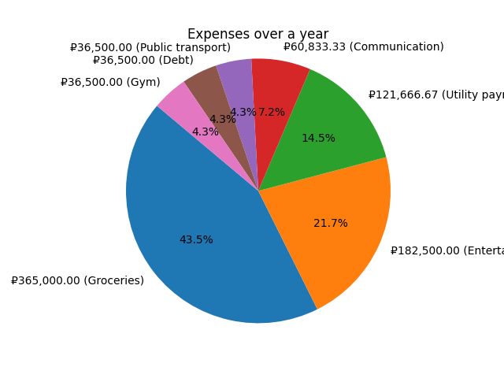
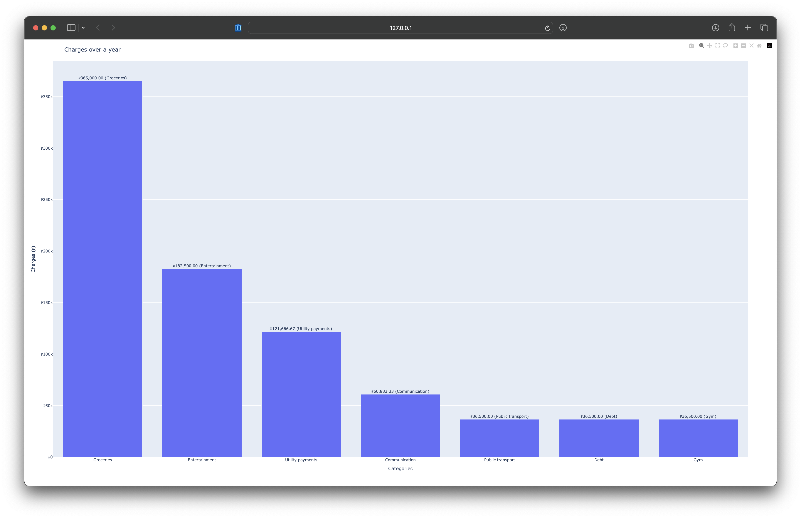

# Expense Tracker

## Overview
The Expense Tracker is a Python-based application designed to help users track their expenses, convert currencies, and visualize their spending habits. It supports recurring payments and provides various ways to summarize and plot expenses.


## Demo

You can run the demo by executing the following command:
```sh
poetry run python main.py
```

Use [example_payments.py](example_payments.py) or create your own `my_payments.py`

The demo will display the total expenses and a pie chart of the expenses over the last 365 days in Russian rubles.

```
₽365,000.00 (Groceries)
₽182,500.00 (Entertainment)
₽121,666.67 (Utility payments)
₽60,833.33 (Сommunication)
₽36,500.00 (Public transport)
₽36,500.00 (Debt)
₽36,500.00 (Gym)

₽839,500.00
```



Also you can see interactive bar plot of the expenses over the last 365 days in Russian rubles.




## Features
- **Payment Tracking**: Add and manage payments, including recurring payments.
- **Currency Conversion**: Convert between different currencies using static or updatable exchange rates.
- **Expense Summarization**: Calculate total expenses over a specified period.
- **Data Visualization**: Generate pie charts and interactive bar plots to visualize expenses.

## Installation
Install the required dependencies:
```sh
poetry install
```


## Usage
1. **Add Payments**:
    ```python
    from expense_tracker import PaymentTracker, Payment, MoneyValue, Currency
    from datetime import timedelta
    from decimal import Decimal

    payment_tracker = PaymentTracker()
    payment = Payment(description="Groceries", money_value=MoneyValue(amount=Decimal("100"), currency=Currency.USD))
    payment_tracker.add_payment(payment)
    ```

2. **Convert Currency**:
    ```python
    from expense_tracker import StaticCurrencyConverter, Currency

    converter = StaticCurrencyConverter()
    converted_amount = converter.convert(Decimal("100"), Currency.USD, Currency.EUR)
    ```

3. **Summarize Expenses**:
    ```python
    from expense_tracker import ExpenseSummary

    summary = ExpenseSummary(payment_tracker, converter)
    total = summary.total(timedelta(days=30), Currency.USD)
    ```

4. **Plot Expenses**:
    ```python
    from expense_tracker import ExpensePlotter

    plotter = ExpensePlotter()
    charges = summary.charges(timedelta(days=30), Currency.USD)
    plotter.pie(charges, timedelta(days=30))
    ```
   
5. **Run the Application**:
    ```sh
    tracker = PaymentTracker()
    currency_converter = UpdatableCurrencyConverter()
    summary = ExpenseSummary(tracker, currency_converter)
    plotter = ExpensePlotter()

    tracker.add_payments(MY_PAYMENTS)

    period = timedelta(days=365)
    currency = Currency.RUB

    sorted_charges = sorted(
        summary.charges(period, currency),
        key=lambda x: x.money_value.amount,
        reverse=True,
    )
    for charge in sorted_charges:
        print(charge)
    print(summary.total(period, currency))
    plotter.pie(sorted_charges, period)
    plotter.interractive_barplot(sorted_charges, currency, period)
    ```

You can also use `main.py` to run the application.

## License
This project is licensed under the MIT License. See the `LICENSE` file for more details.

## Author
- Ruslan Sirazhetdinov [irusland](https://github.com/irusland)
